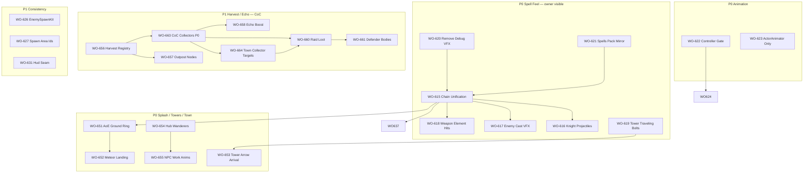

# GROK Work Orders — Full Codebase Audit (2026-07-09)

**Author:** Grok CLI audit session (spell/VFX + animation + architecture + perf + canon)  
**Branch audited:** `wip/village2-and-f8-tickets`  
**Numbering:** New block **WO-615 → WO-664** (mint after WO-614 skill-tree; confirm in `CLI_LANES_WO_NUMBERS.md` + Notion board)  
**How to use:** Each section is a **READY TO IMPLEMENT** spec slice. Copy individual WOs to `WorkOrders/WORK_ORDER_NNN_short_name.md` when claiming. Cross-ref existing WOs before duplicating work.

---

## Executive Summary — Why Spells / Weapons / Animations Feel Broken

| Symptom (owner-reported) | Root cause (code-proven) |
|---|---|
| Hero casts but no spell graphics | `ff.knightonly` default → Knight uses **instant melee** (`HeroAbilities.LaunchProjectile` skips projectile); abilities gated on `BattleLock.IsInBattle()` outside arena |
| Cast anim plays, weak/wrong FX | **Triple stack**: `SpellVfxFactory.PlayCast` + `AbilityVfxKit.PlayHeroAbility` + debug green burst in `RangedAttackVFX` |
| `PlayHeroAbility` plays projectile types as **oneshot at feet** | `AbilityVfxKit` early-returns on `VFXManager.Play(Projectile_*)` — not a traveling bolt |
| Enemy cast invisible / boring | All casters fire generic `Projectile_Arcane`; catalog entries `Cast_EnemyCaster` / `Projectile_EnemyCasterBolt` **never called** |
| Fire/lightning on weapons | **Design only** (`docs/vfx/weapon_vfx_design.md`); `PlayerAttackController` always `DamageElement.None`; `WeaponVfxMap` = swing trail tint only |
| Packs look flat (animation) | `InCombat` param existed but **CombatLocomotion transitions were missing** on shipped controllers until recent bake; overworld reps had no combat-presentation drive |
| Towers inconsistent | `ArcaneTower` = full cast→travel→impact chain; `DefenseTower` Spell style = **instant pop** at target; **Bolt style flies visually but damage is hitscan** (no `onArrive`) |
| AoE / cleave / meteor feel flat | `AbilityVfxKit.PlayHeroAbility` **early-returns** on `VFXManager.Play` — plays a **point oneshot** at blast centre; **ignores `radius`**; procedural `BuildNova` / `BuildGroundRing` / `BuildMeteor` never runs when catalog prefab exists |
| Meteor lands before it falls | `HeroAbilities` calls `Blast` + `SpawnVfx` **same frame** — damage at sky point while `BuildMeteor` streak is cosmetic |
| Town NPCs lifeless | Castle hub vendors = `AmbientNPC` **wander=false** (frozen); `Npc.controller` = Idle/Move only (**no `IsTalking`/Talk**); no work loops (blacksmith hammer); hub builder leaves **comments** for roam NPCs but does not spawn wanderers |
| Harvest feels disconnected | **5 banking paths**; no CoC **pending→collect** loop; `ResourceBuildingHarvester` banks straight to wallet (not collector-internal storage); raid loot not tied to uncollected pending |

**Reference implementation to copy:** `ArcaneTower.FireBlast` → `ProjectileVFXCatalog` (cast / fly / explode).

---

## Priority Legend

| Priority | Meaning |
|---|---|
| **P0** | Owner-visible spell/weapon/animation breakage — ship first |
| **P1** | Consistency + architecture debt blocking quality |
| **P2** | Perf, tests, canon hygiene |
| **P3** | Long-horizon consolidation |

**Lanes (§9):** VFX/Audio, Combat/AI, Animation, World, HUD, Docs, Perf — parallelize across lanes; same-file = one agent.

---

# P0 — SPELL, VFX & WEAPON GRAPHICS (Owner Priority)

---

## WO-615 — Spell VFX Chain Unification (Hero + Enemy)

**Status:** READY TO IMPLEMENT  
**Priority:** P0  
**Lane:** VFX/Audio + Combat  
**Supersedes / extends:** WO-195 (`WORK_ORDER_195_spell_vfx_factory.md`) — finish the orphaned APIs  
**Depends on:** None (foundational)

### Problem
Four overlapping VFX stacks with no single owner for `cast → travel → impact`:
- `VFXManager` + `VFXCatalog`
- `ProjectileVFXCatalog` (Resources mirrors)
- `AbilityVfxKit` (procedural + **broken** `PlayHeroAbility` router)
- `SpellVfxFactory` (**only `PlayCast` wired**; `PlayImpact` / `PlayProjectile` never called)

### Files to edit
| File | Change |
|---|---|
| `Assets/_Modules/Village/Vfx/SpellVfxFactory.cs` | Wire `PlayImpact` + `PlayProjectile`; element routing table |
| `Assets/_Modules/Village/Hero/HeroAbilities.cs` | `SpawnVfx` — **one** cast path; remove double-fire with `PlayHeroAbility` |
| `Assets/_Modules/Village/Hero/AbilityVfxKit.cs` | Fix `PlayHeroAbility` — do NOT `VFXManager.Play()` projectile/loop enum types as oneshots |
| `Assets/_Modules/Village/Hero/RangedAttackVFX.cs` | On arrival → `SpellVfxFactory.PlayImpact`; remove/gate debug green/red bursts |
| `Assets/_Modules/Village/Enemies/Enemy.cs` | `RootedCast` / legacy ranged → catalog impact + element match |
| `Assets/_Modules/Village/Buildings/ProjectileVFXCatalog.cs` | Single impact entry point called by factory |

### Acceptance criteria
- [ ] Mage/Ranger ability: **one** cast VFX at wind-up, **visible pooled projectile**, **element-matched impact** on arrival
- [ ] `FlowTrace` shows `PlayImpact` fired with correct element (capture line required)
- [ ] No duplicate cast burst at caster feet when projectile is in flight
- [ ] Headless: `DataRegression` or new EditMode test — `SpellVfxFactory.ResolveElement("fire")` → `VFXType.Impact_Flame` (or catalog equivalent)
- [ ] Brace check + `COMPILE_GATE_OK`

### Do NOT touch
- `Village.unity` (abandoned)
- Mirza Beig pack import (curation only via catalog entries)

---

## WO-616 — Hero Spell Projectiles for Knight Loadout (ff.knightonly)

**Status:** READY TO IMPLEMENT  
**Priority:** P0  
**Lane:** Combat + VFX  
**Depends on:** WO-615 (shared projectile path)

### Problem
Default player is Knight (`ff.knightonly` ON). `HeroAbilities.LaunchProjectile` calls `onArrive` instantly for knight — **no flying spell graphic** even when loadout grants W/E/R “spell-like” abilities.

```csharp
// HeroAbilities.cs ~910
else if (_heroClass == "knight") onArrive?.Invoke();   // melee: instant, no projectile
```

### Files to edit
| File | Change |
|---|---|
| `Assets/_Modules/Village/Hero/HeroAbilities.cs` | Per-ability `delivery: melee \| projectile \| aoe` from data (not class string) |
| `Assets/Resources/Data/Canonical/abilities.json` (or loadout defs) | Tag spell abilities with `projectile: true` + element |
| `Assets/_Modules/Core/FeatureFlags.cs` | Document — no change required unless owner wants Mage body |

### Acceptance criteria
- [ ] Knight W/E/R abilities marked `projectile` show **visible bolt** (arcane/fire/storm per element)
- [ ] Knight melee primary (LMB / slot 0) stays instant — no regression
- [ ] Owner felt-verify in BattleArena: cast → see orb leave hand → impact on enemy
- [ ] Instrument: `[Flow:HeroAbility] projectile launched id=... element=...`

### Do NOT touch
- Hero body swap / class selection UX (separate WO)

---

## WO-617 — Enemy Caster VFX + Cast Root (Readable Channels)

**Status:** READY TO IMPLEMENT  
**Priority:** P0  
**Lane:** VFX + Combat/AI  
**Depends on:** WO-615

### Problem
- Enemies use `RangedAttackVFX.FireSpellOrb` → always `Projectile_Arcane` / `Aether`
- `VFXCatalog` has `Cast_EnemyCaster` + `Projectile_EnemyCasterBolt` — **unused**
- `Enemy.DriveNav` has no `_casting` guard — caster slides during channel (F8-38)
- Owner F8: “could not tell he was casting”

### Files to edit
| File | Change |
|---|---|
| `Assets/_Modules/Village/Enemies/Enemy.cs` | `RootedCast`: play `Cast_EnemyCaster` at wind-up; element from enemy id/def; guard `DriveNav` while `_casting` |
| `Assets/_Modules/Village/Hero/RangedAttackVFX.cs` | `FireSpellOrb(enemy, element)` overload — route `Projectile_EnemyCasterBolt` + fire/ice/storm variants |
| `Assets/_Modules/Village/Enemies/EnemyBrain.cs` | Map caster id → `DamageElement` for VFX (orc-mage → fire, hollow-acolyte → aether, etc.) |
| `Assets/Editor/VFXCatalogGenerator.cs` | Verify enemy cast/bolt entries resolve |

### Acceptance criteria
- [ ] Orc mage overworld + arena: wind-up pose + **visible charge VFX** + orb + impact — no slide during channel
- [ ] Hollow acolyte uses distinct silhouette/VFX from orc mage
- [ ] Headless capture: `[Flow:EnemyCast] CAST-START` + no `DriveNav SetDestination` lines during `_casting`
- [ ] `ff.enemyrootedcast` OFF path still shows minimum cast anim (no silent instant hit)

### Do NOT touch
- Rep hook zero-damage contract (overworld reps stay non-combatants)

---

## WO-618 — Weapon Elemental Hit VFX (Fire / Lightning / Frost)

**Status:** READY TO IMPLEMENT  
**Priority:** P0  
**Lane:** VFX + Combat  
**Design source:** `docs/vfx/weapon_vfx_design.md`  
**Depends on:** WO-615 (shared `VFXManager.Play` impact types)

### Problem
Melee hits always `DamageElement.None`. `WeaponVfxMap` only tints swing trail. Owner wants **fire/lightning on weapons** — design doc exists, **zero gameplay wiring**.

### Files to edit
| File | Change |
|---|---|
| `Assets/_Modules/Village/Hero/PlayerAttackController.cs` | `ResolveAttack` → read weapon element from `GearLoadout` / `weapons.json` |
| `Assets/_Modules/Village/Hero/WeaponVfxMap.cs` | Add `HitSparkVfxFor(weaponId, element, tier)` → `VFXType` |
| `Assets/Resources/Data/Canonical/weapons.json` | `element` field per weapon (emberbrand → fire, stormblade → lightning, etc.) |
| `Assets/Editor/VFXCatalogGenerator.cs` | Wire Spells Pack impact prefabs per element tier |
| `Assets/_Modules/Village/Vfx/VFXManager.cs` | Reuse pooled impact — no `new Material` per hit |

### Acceptance criteria
- [ ] Equip Emberbrand → melee hit spawns **fire impact** at contact point (pooled)
- [ ] Lightning-tier weapon → shock/spark impact (not recolored fire)
- [ ] Common iron sword → physical spark only (no element)
- [ ] Block/parry still uses existing shockwave — no double VFX
- [ ] Owner felt-verify: 5 sword tiers visibly escalate

### Do NOT touch
- Damage numbers / balance formulas (VFX-only slice)

---

## WO-619 — DefenseTower Spell Style = Traveling Bolt (Match ArcaneTower)

**Status:** READY TO IMPLEMENT  
**Priority:** P0  
**Lane:** VFX + Buildings  
**Reference:** `ArcaneTower.FireBlast`, `PooledProjectile`  
**Depends on:** WO-615 (optional — can use `ProjectileVFXCatalog` directly)

### Problem
`DefenseTower` with `BoltStyle.Spell` plays cast + impact **instantly** at target — no travel. `ArcaneTower` has the correct chain. Player sees inconsistent tower behavior.

### Files to edit
| File | Change |
|---|---|
| `Assets/_Modules/Village/Buildings/DefenseTower.cs` | Spell style → `PooledProjectile` or `ProjectileMover` path (same as ArcaneTower) |
| `Assets/_Modules/Village/Buildings/ProjectileVFXCatalog.cs` | Tower element variants if missing |
| `Assets/_Modules/Village/Buildings/ArcaneTower.cs` | Extract shared `TowerBoltLauncher` static helper (optional, preferred) |

### Acceptance criteria
- [ ] Fire/Ice/Arcane defense towers shoot **visible traveling bolt**
- [ ] Impact VFX on arrival + damage unchanged
- [ ] Headless: tower regression trace shows `ProjectileVFXCatalog.SpawnFlying` not double `VFXManager.Play` at target
- [ ] Perf: no per-shot `Instantiate` (pool only)

### Do NOT touch
- Tower targeting / aggro logic

---

## WO-620 — Remove Production Debug VFX + Gate Dev Bursts

**Status:** READY TO IMPLEMENT  
**Priority:** P0  
**Lane:** VFX  

### Problem
`RangedAttackVFX` still fires **green launch / red land** debug bursts (owner 2026-06-02 debug colors) in production builds — reads as broken spell FX.

### Files to edit
| File | Change |
|---|---|
| `Assets/_Modules/Village/Hero/RangedAttackVFX.cs` | Remove or wrap in `FeatureFlags.DevHotkeys` |
| `Assets/_Modules/Village/Hero/AbilityVfxKit.cs` | Audit for similar debug-only particles |

### Acceptance criteria
- [ ] Ship build: zero green/red debug bursts on hero or enemy projectiles
- [ ] `ff.devhotkeys=1` optionally restores for CLI diagnosis
- [ ] Owner felt-verify: projectiles look like spells, not debug markers

---

## WO-621 — Spells Pack Mirror Expansion + Catalog Sync

**Status:** READY TO IMPLEMENT  
**Priority:** P0  
**Lane:** VFX/Editor  
**Existing:** `Assets/Editor/SpellsPackVfxMirror.cs` (4 prefabs only)

### Problem
Spells Pack has 100+ prefabs; mirror tool copies **4**. Catalog references pack paths that fail on fresh clone. Lightning/storm/ice chains incomplete.

### Files to edit
| File | Change |
|---|---|
| `Assets/Editor/SpellsPackVfxMirror.cs` | Mirror full element set: cast, projectile, explosion per element |
| `Assets/Editor/VFXCatalogGenerator.cs` | Point at `Resources/VFX/Projectiles/*` only |
| `docs/SPELLS_PACK_NOTES.md` | Update mirrored inventory |

### Acceptance criteria
- [ ] Batchmode: `SPELLS_VFX_MIRROR_OK` + `VFX_CATALOG_OK`
- [ ] Hero storm/ice/fire abilities each resolve a non-null flying prefab
- [ ] URP shader fix runs once in mirror (not triplicated at runtime)

### Do NOT touch
- Gitignored pack source paths (mirror TO Resources)

---

# P0 — ANIMATION (Packs + Combat Read)

---

## WO-622 — Controller Re-bake Gate + CombatLocomotion Verification

**Status:** READY TO IMPLEMENT  
**Priority:** P0  
**Lane:** Animation/Editor  
**Extends:** WO-586 (battle animation posture — bake was pending)

### Problem
Shipped `OrcHumanoid.controller` / `Knight.controller` had `InCombat` param **without transitions** (documented in `ANIMATION_DOSSIER_2026-07-03`). Recent session added CombatLocomotion to builder — needs **regression gate** so re-bake never ships stub again.

### Files to edit
| File | Change |
|---|---|
| `Assets/Editor/BuildOrcHumanoidController.cs` | Already has CombatLocomotion — add marker `ORC_CTRL_COMBAT_OK` |
| `Assets/Editor/PeopleCharacterImporter.cs` | `RebuildSkeletonHumanoidControllerOnly` — same |
| `Assets/Editor/DataRegression.cs` or new `AnimControllerRegression.cs` | Load controllers; assert `CombatLocomotion` state exists + `InCombat` has ≥1 transition |
| `Assets/Tests/EditMode/AnimControllerTests.cs` | NEW — transition count assertions |

### Acceptance criteria
- [ ] `COMPILE_GATE_OK` + `ANIM_CTRL_COMBAT_OK` in batchmode
- [ ] EditMode: OrcHumanoid has `CombatLocomotion` state
- [ ] Owner felt-verify: pack chase uses **combat run**, not casual walk

---

## WO-623 — ActorAnimator-Only Enemy Drive (Delete Duplicate Paths)

**Status:** READY TO IMPLEMENT  
**Priority:** P1  
**Lane:** Animation  

### Problem
`Enemy.DriveAnimator` writes **both** `_actor.SetLocomotion` and `_animator.SetFloat(AnimSpeed)`. Contact/ranged attacks use raw `_animator.SetTrigger` in some paths, `_actor` in others. Param-spam risk; drift when controllers change.

### Files to edit
| File | Change |
|---|---|
| `Assets/_Modules/Village/Enemies/Enemy.cs` | All anim writes through `_actor` only; remove duplicate `_animator.SetFloat` for Speed |
| `Assets/_Modules/Village/Enemies/Enemy.cs` | Hit/death/windup — `PlayHit` / `Die` / `PlayWindUp` only |

### Acceptance criteria
- [ ] Grep: zero `_animator.SetTrigger` in `Enemy.cs` except inside `ActorAnimator` delegation
- [ ] Headless enemy spawn: no “Parameter does not exist” spam in log
- [ ] Arena + wave enemies still walk/attack/die correctly

---

## WO-624 — Animation-Driven Ability Timings (Knight Mocap Actives)

**Status:** READY TO IMPLEMENT (DESIGN — blocked on WO-622 felt-verify)  
**Priority:** P1  
**Lane:** Animation + Combat  
**Existing:** `WORK_ORDER_585_knight_animation_driven_abilities.md`

### Problem
Abilities fire VFX/damage on **timers**, not animation events — spells don’t line up with hands. Owner wants cast clips to **sell** the spell.

### Files to edit
| File | Change |
|---|---|
| `Assets/_Modules/Village/Hero/HeroAbilities.cs` | Subscribe to animation events OR normalized-time gates per ability id |
| `Assets/Editor/HeroAnimatorFactory.cs` | Add event markers on Cast/Attack clips at release frame |
| `docs/ANIMATION_PIPELINE.md` | Document clip→ability mapping table |

### Acceptance criteria
- [ ] Meteor/Cleave/Arcane Blast: damage/VFX at **release frame** of cast anim (±1 frame tolerance)
- [ ] Headless: `[Flow:HeroAbility] anim-event release id=...` lines in capture
- [ ] No damage before wind-up completes when `ff.enemyrootedcast` analog enabled for hero

---

## WO-625 — IsAlert + Pre-Combat Stance on Enemy Controllers

**Status:** READY TO IMPLEMENT  
**Priority:** P2  
**Lane:** Animation  

### Problem
`EnemyBrain` drives `IsAlert` animator param (~line 1034) but **no controller declares `IsAlert`** — dead code; enemies don’t shift to alert pose before chase.

### Files to edit
| File | Change |
|---|---|
| `Assets/Editor/BuildOrcHumanoidController.cs` | Add `IsAlert` bool + AlertIdle state OR fold into `InCombat` |
| `Assets/_Modules/Village/Enemies/EnemyBrain.cs` | Drive via `ActorAnimator` / document mapping to `InCombat` |
| `Assets/_Modules/Village/Enemies/OverworldEncounterSpawner.cs` | Rep aggro → alert stance before chase |

### Acceptance criteria
- [ ] Rep spots hero: transitions to alert/combat idle **before** movement accelerates
- [ ] No animator param warnings in log

---

# P1 — COMBAT / AI CONSISTENCY

---

## WO-626 — EnemySpawnKit (Unified Brain + Tactics + Family)

**Status:** READY TO IMPLEMENT  
**Priority:** P1  
**Lane:** Combat/AI  
**Extends:** WO-606 fast-follows

### Problem
`ApplyRoleTactics` wired in `BattleArena` + `EnemyGroupSpawner` but **not** in `RegionMobSpawner`, overworld followers, or scatter spawns. Duplicate spawn logic across 5 files.

### Files to edit
| File | Change |
|---|---|
| `Assets/_Modules/Village/Enemies/EnemySpawnKit.cs` | **NEW** — `AttachBrain(enemy, id, role, heroOnly, applyTactics, familyLeader?)` |
| `Assets/_Modules/Village/Enemies/OverworldEncounterSpawner.cs` | Use kit for followers |
| `Assets/_Modules/Village/World/RegionMobSpawner.cs` | Use kit + tactics |
| `Assets/_Modules/Village/Arena/BattleArena.cs` | Use kit (replace inline) |

### Acceptance criteria
- [ ] EditMode: lint/registry test — every spawner calls `EnemySpawnKit`
- [ ] Wave composed group: DPS uses coordinated flank; mage kites; tank siege delay
- [ ] Region mob packs behave same as arena family tactically

---

## WO-627 — spawn-areas.json Id Alignment + Far-Region Enemy Defs

**Status:** READY TO IMPLEMENT  
**Priority:** P1  
**Lane:** Data + Combat  
**WO-606 fast-follow**

### Problem
`spawn-areas.json` references `skeleton-warrior`, `skeleton-mage`, `troll-berserker` — not in `enemies.json` / `EnemyFactory` explicit map. Falls through to wrong silhouettes with `FlowTrace.Warn`.

### Files to edit
| File | Change |
|---|---|
| `Assets/Resources/Data/Canonical/spawn-areas.json` | Align ids with `hollow-warrior` OR add aliases |
| `Assets/Resources/Data/Canonical/enemies.json` | Add missing far-band defs |
| `Assets/_Modules/Village/Enemies/EnemyFactory.cs` | Alias table: `skeleton-warrior` → `Skeleton_Warrior` model |
| `Assets/_Modules/Core/World/SpawnAreaTable.cs` | Document id resolution |

### Acceptance criteria
- [ ] Headless scatter generate: zero `FlowTrace.Warn` for unknown family ids
- [ ] Far-band scatter packs show hollow/troll silhouettes correctly
- [ ] Engage → BattleArena spawns matching family

---

## WO-628 — BattleArena ArenaPreset → Footprint Size

**Status:** READY TO IMPLEMENT  
**Priority:** P1  
**Lane:** Combat  
**WO-606 fast-follow #1**

### Problem
`EncounterParams.ArenaPreset` forwarded from spawn areas but `BattleArena` uses const `ArenaHalfWidth` / `ArenaHalfDepth` — data is dead.

### Files to edit
| File | Change |
|---|---|
| `Assets/_Modules/Village/Arena/BattleArena.cs` | Read preset → arena dimensions table |
| `Assets/_Modules/Village/Arena/EncounterParams.cs` | Document preset keys |
| `Assets/Resources/Data/Canonical/spawn-areas.json` | Author presets (small/med/large/boss) |

### Acceptance criteria
- [ ] Far-band engage uses larger arena (owner-tunable)
- [ ] Headless: `[Flow:BattleArena] arena preset=... width=...`

---

## WO-629 — Arena Healer Role Fix (heroOnly Targeting)

**Status:** READY TO IMPLEMENT  
**Priority:** P1  
**Lane:** Combat/AI  

### Problem
`EnemyBrain.SetHeroOnlyTarget(true)` short-circuits before Healer branch — arena healers don’t heal.

### Files to edit
| File | Change |
|---|---|
| `Assets/_Modules/Village/Enemies/EnemyBrain.cs` | `ChooseTarget`: Healer scans allies before hero-only return |
| `Assets/Tests/EditMode/EnemyBrainTargetingTests.cs` | **NEW** — healer + heroOnly matrix |

### Acceptance criteria
- [ ] Arena orc family with acolyte: healer mends wounded ally while hero is target
- [ ] EditMode test passes

---

## WO-630 — ATB Animator Parity or Retirement Decision

**Status:** READY TO IMPLEMENT (needs owner call on retire)  
**Priority:** P2  
**Lane:** Combat  

### Problem
`AtbCombatantSwapper` loads `"OrcHumanoid"` base — **no role overrides**. Arena uses `OrcHumanoid_Mage/_Tank/_Warrior`. ATB is flat/static per canon but still ships.

### Options (owner pick)
- **A)** Wire `EnemyAnimatorFactory.Apply` in ATB swapper
- **B)** Retire ATB scenes from build — document only

### Acceptance criteria
- [ ] Documented decision in `CANON_GROUND_TRUTH_<date>.md`
- [ ] If A: ATB mage shows cast anim + VFX

---

# P1 — ARCHITECTURE & HUD

---

## WO-631 — IVillageHud Seam Phase 1 (Kill Top 5 Reflection Bridges)

**Status:** READY TO IMPLEMENT  
**Priority:** P1  
**Lane:** Core + HUD  
**Source:** `docs/TECH_DEBT_LEDGER.md` #1

### Problem
~26–30 `Type.GetType` / `GetMethod` bridges between Village ↔ HUD. Highest structural risk.

### Files to edit
| File | Change |
|---|---|
| `Assets/_Modules/Core/HUD/IVillageHud.cs` | Extend: wave state, arena state, cast bar hooks |
| `Assets/_Modules/HUD/VillageHudController.cs` | Implement new iface methods |
| `Assets/_Modules/Village/**/*HudBridge.cs` | Delete bridges replaced by iface (top 5 by call count) |
| `Assets/_Modules/HUD/AdminOverlay.cs` | Remove Village reflection |

### Acceptance criteria
- [ ] Grep: ≥5 fewer `GetMethod`/`GetType` in HUD assembly
- [ ] Wave start/end still updates HUD
- [ ] No new Village → HUD direct references

### Do NOT touch
- UiKit visual redesign (WO-405/403)

---

## WO-632 — Move Battle End-State UI to HUD Assembly

**Status:** READY TO IMPLEMENT  
**Priority:** P2  
**Lane:** Architecture  
**Source:** COV-006

### Problem
`Assets/_Modules/Village/UI/EndState/*` — presentation in Village assembly; bypasses `PanelManager`.

### Acceptance criteria
- [ ] End-state panels live under `DeNelle.HUD`
- [ ] Village emits events only
- [ ] Win/loss flow unchanged (headless + felt)

---

# P2 — PERFORMANCE

---

## WO-633 — Hero Singleton Cache for Overworld Watchers

**Status:** READY TO IMPLEMENT  
**Priority:** P2  
**Lane:** Perf  

### Problem
`RepEngageWatcher`, `BattleArena`, `OverworldEncounterSpawner` call `FindWithTag("Player")` **every frame** per rep (P2-2 perf audit).

### Files to edit
| File | Change |
|---|---|
| `Assets/_Modules/Core/CoreServices.cs` or `HeroRegistry.cs` | **NEW** — `HeroTransform` cached on `sceneLoaded` + invalidation |
| `Assets/_Modules/Village/Enemies/OverworldEncounterSpawner.cs` | Use cache |
| `Assets/_Modules/Village/Arena/BattleArena.cs` | Use cache in `WatchToResolution` |

### Acceptance criteria
- [ ] Profiler: zero `FindWithTag` in overworld rep hot loop (grep + headless perf trace)
- [ ] Hero warp across seam still resolves (cache refresh on `OnTeleported`)

---

## WO-634 — Tripo Enemy Material Cache (P0-2 Perf)

**Status:** READY TO IMPLEMENT  
**Priority:** P2  
**Lane:** Perf  
**Extends:** WO-568

### Problem
`EnemyFactory` / `TripoMaterialFixer` — `new Material` per slot per spawn. GC storm at wave/overworld caps.

### Acceptance criteria
- [ ] Material cache keyed by shader+texture hash
- [ ] Headless: spawn 20 enemies — `[Flow:Perf]` material alloc count flat

---

## WO-635 — Tripo Mesh Combine / LOD for Enemies

**Status:** READY TO IMPLEMENT  
**Priority:** P2  
**Lane:** Perf/Art  
**Source:** PERF audit P0-1

### Problem
`VisualFactory` — multiple SMR per enemy, no combine. Draw-call heavy at caps.

### Acceptance criteria
- [ ] Editor bake: combined mesh per Tripo archetype
- [ ] Fleet: draw calls reduced (owner perf trace or headless counter)

---

# P2 — TESTS & QA GATES

---

## WO-636 — EditMode Green + PackCatalogTest Fix

**Status:** READY TO IMPLEMENT  
**Priority:** P1  
**Lane:** QA  
**Existing:** `WORK_ORDER_545_editmode_pre_existing_test_failures.md`

### Acceptance criteria
- [ ] `DataRegression.RunAll` → `REGRESSION_OK`
- [ ] PackCatalogTest expects 13 packs (not 5)
- [ ] Document pre-existing arena texture failures if still open

---

## WO-637 — Spell VFX Integration Tests

**Status:** READY TO IMPLEMENT  
**Priority:** P2  
**Lane:** QA  
**Depends on:** WO-615

### Acceptance criteria
- [ ] EditMode: `ProjectileVFXCatalog.SpawnFlying` returns non-null for fire/arcane/storm
- [ ] EditMode: `SpellVfxFactory.PlayImpact` does not throw; resolves VFXType
- [ ] PlayMode or AutoPilot: hero cast produces `projectile` + `impact` flow trace lines

---

## WO-638 — EnemyBrain Targeting Test Suite

**Status:** READY TO IMPLEMENT  
**Priority:** P2  
**Lane:** QA  

### Acceptance criteria
- [ ] EditMode tests: Tank, Healer, Kiter, heroOnly, provoke, taunt matrices
- [ ] Covers WO-629 regression

---

## WO-639 — Animation Controller Regression Gate

**Status:** READY TO IMPLEMENT  
**Priority:** P2  
**Lane:** QA  
**Depends on:** WO-622

### Acceptance criteria
- [ ] Batchmode fails if `InCombat` param has zero transitions
- [ ] Part of `DataRegression.RunAll`

---

# P2 — CANON & DOCS HYGIENE

---

## WO-640 — Canon Sync Sprint (Catalog + CLAUDE §5 + Schema v28)

**Status:** READY TO IMPLEMENT  
**Priority:** P2  
**Lane:** Docs  
**Binding:** CLAUDE.md §15

### Stale items (code-proven)
| Doc | Drift |
|---|---|
| `docs/MASTER_CATALOG.md` | 159+ new .cs undocumented |
| `CLAUDE.md` §5 | Lists 6 assemblies; live **18** |
| `docs/ARCHITECTURE.md` | Save schema v20; code **v28** |
| `AM_VERIFY_CHECKLIST.md` | Says EnemyBrain N/A — **wrong** |
| `GROK_SYNC_PACK.md` | Branch/commit stale |

### Acceptance criteria
- [ ] New `CANON_GROUND_TRUTH_2026-07-09.md` anchor
- [ ] `SESSION_CANON_LOADER.md` updated
- [ ] `AM_VERIFY_CHECKLIST.md` EnemyBrain row fixed

---

## WO-641 — Monster Family Architecture Doc Reconcile

**Status:** READY TO IMPLEMENT  
**Priority:** P3  
**Lane:** Docs + Combat  

### Problem
`docs/MONSTER_FAMILY_ARCHITECTURE.md` describes `MonsterFamily` coordinator + `FamilyData` SO — **not implemented**. Reality = `FamilyLeader` + `FamilyMember` (WO-146 subset).

### Acceptance criteria
- [ ] Doc banner: IMPLEMENTED SUBSET vs PLANNED
- [ ] Or implement thin `MonsterFamily` shell — owner pick

---

# P3 — CONTENT & LONG-HORIZON

---

## WO-642 — Mirza Beig VFX Curation Pass (658 prefabs, 0 wired)

**Status:** READY TO IMPLEMENT  
**Priority:** P3  
**Lane:** VFX/Art  

### Acceptance criteria
- [ ] Curate 30 high-value oneshots (lightning, shockwave, boss hit) into `VFXCatalog`
- [ ] Document mapping in `docs/MAGIC_VFX_LIBRARY.md`
- [ ] No runtime `Instantiate` — pool via VFXManager

---

## WO-643 — Upper-Body Attack Layer for Enemies (Move While Casting)

**Status:** READY TO IMPLEMENT  
**Priority:** P3  
**Lane:** Animation  
**Reference:** Hero `ActorAnimator` upper-body layer (WO-218)

### Acceptance criteria
- [ ] Orc mage can **strafe** while casting (legs locomotion, arms cast)
- [ ] Controller layer mask: arms+torso

---

## WO-644 — Pet Animator Resources + Dead Bool Fix

**Status:** READY TO IMPLEMENT  
**Priority:** P3  
**Lane:** Pets/Animation  

### Problem
`PetDeployer` loads `Resources/Pets/*` — null; `Death` trigger vs `Dead` bool mismatch.

---

## WO-645 — Unified Controller Rebuild Menu

**Status:** READY TO IMPLEMENT  
**Priority:** P3  
**Lane:** Editor  

### Problem
Six controller builders (`HeroAnimatorFactory`, `BuildOrcHumanoidController`, `AnimatorSetup`, etc.) — no single “rebuild all” gate.

### Acceptance criteria
- [ ] Menu: `Defenders/Animation/Rebuild All Combat Controllers`
- [ ] Runs orc + skeleton + knight + kaykit; prints single OK marker

---

## WO-646 — VFX Quality Cap Observability (Silent Drops)

**Status:** READY TO IMPLEMENT  
**Priority:** P3  
**Lane:** VFX  

### Problem
`VFXManager` oneshot caps drop VFX mid-fight — only throttled `FlowTrace` — looks like “spells stopped working”.

### Acceptance criteria
- [ ] HUD dev counter or F8 flag when cap drops
- [ ] Owner can see overload vs bug

---

## WO-647 — Weapon Persistent Aura (Tiered Ember / Storm Glow)

**Status:** READY TO IMPLEMENT  
**Priority:** P3  
**Lane:** VFX  
**Extends:** WO-618

### Design
Legendary weapons carry subtle loop aura on weapon bone (Spells Pack `Titles` / ember loop).

---

## WO-648 — Hero BattleLock UX (Why Spells Don't Fire in Town)

**Status:** READY TO IMPLEMENT  
**Priority:** P3  
**Lane:** HUD/UX  

### Problem
`HeroAbilityInput` returns early when `!BattleLock.IsInBattle()` — **by design** but invisible to player.

### Acceptance criteria
- [ ] Press Q in town → HUD toast “Abilities available in combat” (not silent)
- [ ] No gameplay change to gating

---

## WO-649 — Consolidate URP Shader Fix (Single Entry Point)

**Status:** READY TO IMPLEMENT  
**Priority:** P3  
**Lane:** VFX  

### Problem
URP particle shader fix triplicated: `VFXManager`, `ProjectileVFXCatalog`, `AbilityVfxKit`.

### Acceptance criteria
- [ ] `UrpParticleShaderFixer.Apply(Material)` — one call site at import/mirror

---

## WO-650 — Overworld Spawn Budget Governor (Ring + Scatter)

**Status:** READY TO IMPLEMENT  
**Priority:** P3  
**Lane:** World  

### Problem
`OverworldEncounterSpawner` has ring reps (6) + scatter (18 records) — no unified budget; mutual exclusion with `RegionMobSpawner` undocumented.

### Acceptance criteria
- [ ] Single `MaxLiveHostiles` governor
- [ ] Canon: which spawner owns V1 live loop
- [ ] AutoPilot probe: scatter activate/cull/respawn

---

# P0 — SPLASH / AoE FEEL, TOWER ARROWS & TOWN LIFE (Owner Follow-up 2026-07-09)

Owner-reported gaps beyond the spell-chain WOs: **ground splash rings on cleave/AoE**, **arrows visibly flying from towers**, **simple ambient actions in town** (walk, talk, vendor work).

---

## WO-651 — AoE Splash & Expanding Ground Ring (Cleave / Frost Nova / Bulwark Slam)

**Status:** READY TO IMPLEMENT  
**Priority:** P0  
**Lane:** VFX + Combat  
**Depends on:** WO-615 (shared impact router — can land in parallel if factory exposes `PlayAoE`)  
**Extends:** WO-195 impact APIs

### Problem
AoE abilities **damage correctly** (`HeroAbilities.Blast`) but the **splash animation reads as a flat pop**:

1. `SpawnVfx` → `AbilityVfxKit.PlayHeroAbility` maps AoE/Cleave to `VFXType.Impact_ExplosionAether` or `Impact_ShockwaveRing` and calls `VFXManager.Play(type, position)` — **no `radius` argument**, **no expanding ring**.
2. When any catalog prefab resolves, the method **returns immediately** — the procedural `BuildNova` / `BuildGroundRing` (flat shockwave hugging the ground) **never runs**.
3. Knight cleave and Mage Frost Nova therefore look identical to a single-target impact at the blast centre.

```csharp
// AbilityVfxKit.cs ~229 — early return skips procedural splash
if (type != VFXType.None && VFXManager.Instance != null)
{
    VFXManager.Play(type, position);
    return;
}
```

### Files to edit
| File | Change |
|---|---|
| `Assets/_Modules/Village/Hero/AbilityVfxKit.cs` | `PlayHeroAbility` — pass `radius` into VFXManager; for AoE/Cleave/Heal **do not early-return** on point-burst prefabs unless prefab supports scale; add `PlayAoESplash(type, position, radius, element)` |
| `Assets/_Modules/Village/Vfx/VFXManager.cs` | `PlayScaled(type, position, radius)` or particle `transform.localScale` from blast radius |
| `Assets/_Modules/Village/Vfx/SpellVfxFactory.cs` | `PlayAoEImpact(effect, element, centre, radius)` — routes to ring + centre burst |
| `Assets/_Modules/Village/Hero/HeroAbilities.cs` | `SpawnVfx` — ensure `def.Range` reaches the splash builder (already passed; verify after router fix) |
| `Assets/Editor/VFXCatalogGenerator.cs` | Prefer ring-capable prefabs for `Impact_ShockwaveRing` / `Impact_ExplosionAether` (Lana `Burst_rings`, Spells Pack ground bursts) |

### Acceptance criteria
- [ ] Knight W (Bulwark Slam) / R (Lantern Charge): **expanding flat ground ring** at blast centre, scaled to `def.Range`
- [ ] Mage W (Frost Nova): ice-tinted ring + upward shard burst (procedural or prefab) — not a single dot
- [ ] `FlowTrace`: `[Flow:HeroAbility] aoe-splash radius=... prefab=... procedural=fallback`
- [ ] No duplicate centre burst + ring (one coordinated host)
- [ ] Headless: ability regression fires AoE with `radius >= 3` and trace shows splash step
- [ ] Brace check + `COMPILE_GATE_OK`

### Do NOT touch
- `Blast()` damage formula / freeze duration
- Ability cooldowns or mana costs

---

## WO-652 — Meteor Fall Sequence + Damage on Landing

**Status:** READY TO IMPLEMENT  
**Priority:** P0  
**Lane:** VFX + Combat  
**Depends on:** WO-651 (shared timed-impact helper)

### Problem
Meteor Strike applies **full damage the same frame** the ability resolves:

```csharp
// HeroAbilities.cs ~740 — blast + VFX simultaneous
Blast(target, def.Range, dmg, element, 0f);
SpawnVfx(target, def, def.Range);
```

`AbilityVfxKit.BuildMeteor` has a **0.25s delayed ground ring** (`ParticleSystem.Burst(0.25f, 40)`) and a downward streak from `at + Vector3.up * 6f` — but damage already landed. Player sees enemies die before the meteor "hits."

### Files to edit
| File | Change |
|---|---|
| `Assets/_Modules/Village/Hero/HeroAbilities.cs` | Meteor branch → coroutine: play fall VFX → wait `MeteorFallDuration` (~0.35–0.5s) → `Blast` + impact ring |
| `Assets/_Modules/Village/Hero/AbilityVfxKit.cs` | Extract `BuildMeteor` timing constant; optional `PlayMeteorSequence(centre, radius, onImpact)` callback |
| `Assets/_Modules/Village/Vfx/SpellVfxFactory.cs` | Meteor impact prefab on `onImpact` beat (fire explosion) |
| `Assets/_Modules/Core/Audio/IAudioService.cs` / `AbilityAudioBridge` | Impact SFX on landing beat, not cast beat |

### Acceptance criteria
- [ ] Mage R: visible **streak from sky** → **ground shockwave** → enemies take damage **on landing frame**
- [ ] Owner felt-verify in BattleArena: no "pre-kill" before meteor visual
- [ ] `FlowTrace`: `meteor-fall-start` → `meteor-impact` → `blast-damage`
- [ ] BattleLock / hero death mid-fall cancels coroutine cleanly (no orphan blast)
- [ ] Knight meteor (if loadout grants) uses same timing with physical shockwave palette

### Do NOT touch
- `ResolveBlastCentre` / `CastReach` gating (WO-398)

---

## WO-653 — Tower Arrow/Bolt Travel + Damage on Arrival

**Status:** READY TO IMPLEMENT  
**Priority:** P0  
**Lane:** VFX + Buildings  
**Depends on:** WO-619 (Spell-style traveling bolt — disjoint path for `BoltStyle.Bolt`)  
**Reference:** `TowerCombat.FireSingleProjectile` + `PooledProjectile.OnHit` (damage on arrival)

### Problem
Catalog sets archer/ballista towers to `projectileStyle: "bolt"` (`structures-catalog.json`, `CatalogBootstrap`) and `DefenseTower.BuildBoltVisual()` spawns an elongated shaft — **but damage is hitscan**:

```csharp
// DefenseTower.cs ~409-420 — visual flies, damage instant
GameObject bolt = SpawnProjectileVisual(muzzle, targetPos, "hostile");
PlayFireVfx(muzzle, targetPos);
target.TakeDamage(EffectiveDamage, Element);   // same frame
```

`ProjectileMover.Launch` already accepts `onArrive` — unused. Player sees HP drop before the arrow arrives. Spell-style towers are worse (WO-619): cast + impact at target with **no flying orb**.

Secondary: bolt art is **code primitives** (cylinder + cube) — readable at debug scale but not "arrow from tower" feel. `ProjectileArtSlicer` + `Resources/VFX/Projectiles/` sprites exist but are not wired to `DefenseTower`.

### Files to edit
| File | Change |
|---|---|
| `Assets/_Modules/Village/Buildings/DefenseTower.cs` | Defer `TakeDamage` / `ApplyContactDamage` to `ProjectileMover.Launch(..., onArrive: ...)`; impact VFX + `GameSfx.PlayTowerFire` / `SfxId.FlameArrowLaunch` on arrival |
| `Assets/_Modules/Village/Hero/ProjectileMover.cs` | Ensure pooled reuse clears `onArrive`; trace `onArrive-fired` |
| `Assets/_Modules/Village/Buildings/ProjectileVFXCatalog.cs` | Optional `SpawnArrowBolt(muzzle, target, element, onHit)` — sprite mesh from sliced art |
| `Assets/_Modules/Village/Buildings/TowerCombat.cs` | Audit parity — legacy `Tower` path already uses `PooledProjectile`; document which tower type is canon per structure |
| `Assets/Resources/Data/Canonical/structures-catalog.json` | Verify ballista/archer entries keep `"projectileStyle": "bolt"` |

### Acceptance criteria
- [ ] Ballista / Archer tower: **arrow visible along flight line**; enemy HP changes **when bolt arrives**
- [ ] Muzzle flash at fire; **impact burst** at target on arrival (element-tinted)
- [ ] `FlowTrace`: `[Flow:TowerVfx] bolt-launch` → `bolt-arrive` → `damage-applied`
- [ ] Spell-style towers still covered by WO-619 (traveling orb, not arrow)
- [ ] No per-shot `Instantiate` regression — prefer pool migration or document primitive path as interim
- [ ] Owner felt-verify Village2 raid: place archer tower, watch arrows cross the field

### Do NOT touch
- Tower targeting / `Rescan` perf (separate WO-633)

---

## WO-654 — Castle Hub Ambient Townsfolk (Roam + Proximity Barks)

**Status:** READY TO IMPLEMENT  
**Priority:** P0  
**Lane:** World + NPCs  
**Extends:** WO-116 (named field NPCs — this slice is **ambient wanderers only**)  
**Reference:** `AmbientNPC`, `FolksGranaryBuilder` Bryn pattern, `VillageSceneBuilder.BuildTownsfolk`

### Problem
`MainCastle_Hall` / castle hub has **static vendor NPCs** (`CastleVendorNpcInjector` — `wander=false`) and builder comments for "roaming NPCs" (`CastleHubBuilder.cs` ~35) but **no AmbientNPC wander cluster** in the hub scene. Town feels empty except frozen shopkeepers.

`AmbientNPC` already implements NavMesh roam, proximity bubbles, combat shelter, and animator Speed drive — **not wired in hub**.

### Files to edit
| File | Change |
|---|---|
| `Assets/Editor/CastleHubBuilder.cs` (or new `CastleHubNpcInjector.cs`) | Spawn 4–8 `AmbientNPC` wanderers on baked NavMesh; archetypes from `TownsfolkDialogue`; `TownsfolkController` root hands hero transform |
| `Assets/_Modules/Village/NPCs/TownsfolkController.cs` | Verify hub sub-root discovery (may already `GetComponentsInChildren`) |
| `Assets/Editor/CastleHubBuilder.cs` | NavMesh floor bake reminder + `FlowTrace` census line on build |
| `docs/MASTER_CATALOG/village-npcs.md` | Hub ambient NPC row |

### Acceptance criteria
- [ ] Enter `MainCastle_Hall`: **civilians walk** between market / keep / gate (not T-pose sliding)
- [ ] Approach villager → **word bubble** with archetype line (existing `TownsfolkDialogue`)
- [ ] Wave active → wanderers **flee to shelter** (existing `AmbientNPC` shelter FSM)
- [ ] `FlowTrace`: `combat-active: N ambient NPCs (M wander-eligible)` with N > 0 in hub
- [ ] No hand-edit of `.unity` — rebuild via menu / batchmode
- [ ] People-pack models used when `Resources/NPCs/*` present; placeholder tint fallback OK

### Do NOT touch
- Vendor `wander=false` posts (forge, market, etc.)
- Yarn dialogue graph (WO-116 scope)

---

## WO-655 — Town NPC Work & Gesture Animations (Talk / Hammer / Idle Variety)

**Status:** READY TO IMPLEMENT  
**Priority:** P0  
**Lane:** Animation + NPCs  
**Depends on:** WO-654 (hub NPCs present to judge); reconciles **WO-163** optional tail  
**Reference:** People-pack `AC_Blacksmith`, `AC_AmbientNPC_Tob` (Idle/Walk/**Talk** per `docs/MASTER_CATALOG/village-npcs.md`)

### Problem
Simple town actions are missing:

| Gap | Code reality |
|---|---|
| Talk animation while bubble visible | `AmbientNPC` drives `IsTalking` but generic `Npc.controller` has **only `Speed`** (no Talk state) |
| Blacksmith hammering at anvil | `CastleHubBuilder` places Anvil; **no work animation** on vendor body |
| Idle variety while standing | Vendors frozen in default idle — no wave, look-around, or gesture |
| Roam pause gestures | Overworld reps got `Enemy.PlayAmbientGesture` (session 2026-07-09); **town NPCs have no equivalent** |

### Files to edit
| File | Change |
|---|---|
| `Assets/Editor/AnimatorSetup.cs` | `BuildNpcController` — add `IsTalking` bool + Talk state (mirror `AC_AmbientNPC_Tob`); optional `Work` trigger for hammer |
| `Assets/_Modules/Village/NPCs/AmbientNPC.cs` | `PlayAmbientGesture()` on roam pause + vendor work loop when `!_wander && archetype==Blacksmith` (trigger `Work` or crossfade) |
| `Assets/Resources/NPCs/` controllers | Re-bake `AC_Blacksmith` with Hammer/Work clip if pack provides `hammer`, `smith`, `work` |
| `Assets/_Modules/Village/NPCs/CastleVendorNpcInjector.cs` | Assign work-capable controller per vendor role |
| `CityManifest.draft.README.md` | Document `animHint` → clip mapping for builders |

### Acceptance criteria
- [ ] Blacksmith at forge: **hammer loop** visible while player is out of range; stops for talk bubble
- [ ] Wanderer pauses between destinations: **gesture or look-around** (not frozen slide-stop)
- [ ] Speaking villager: **Talk clip** plays while bubble visible (`IsTalking=true`)
- [ ] Zero animator param errors per frame (WO-163 guard pattern retained)
- [ ] Batchmode: `NPC_CTRL_OK` marker after controller rebuild
- [ ] Owner felt-verify hub: town reads "alive" without combat

### Do NOT touch
- Combat shelter / flee logic (already wired)
- Enemy `PlayAmbientGesture` implementation (reuse pattern only)

---

# P1 — HARVEST / ECHO STRUCTURE (Owner-Approved Design 2026-07-09)

**Design north-star:** **Clash of Clans collector model** on the Elarion spine (`DESIGN_CORE_LOOP_AND_STRUCTURE.md` — seat tier gates, walls = sink, waves = siege).

### CoC mapping (Elarion)

| Clash of Clans | Elarion (target) | Today (gap) |
|---|---|---|
| Gold Mine / Elixir Collector | **Farm / Lumbermill / Forge** (+ placeable outpost collectors) | Tick banks **direct to wallet** (`ResourceBuildingHarvester`) |
| Pending bubble on building | **Uncollected** float above collector; tap or **Collect All** | No pending buffer per building |
| Gold / Elixir Storage | Main wallet + optional **Storage** cap (food supply cap = squad gate) | `EchoService` silo is closest analog |
| Raid steals **uncollected + % storage** | Wave siege loots **pending** on destroyed collectors | `HarvestSite` raid not loot-aware |
| Collector **HP** — destroy in raid | Collector building `IDamageableStructure` | Hub buildings not damageable |
| Upgrade = rate + capacity | `ResourceBuildingProgression` yield + interval | Data exists; pending cap missing |
| Builder places collector | Build mode places collector on node (WO-108) | `MineNode` = manual `[F]` tap |

**Echoes in CoC terms:** not walking miners — **visual spirits** over a collector (or a **production boost** on assigned building). Optional Tier-2 flair; **Tier-1 is building collectors.**

**Owner beat — "brings more to home":** outposts and outer nodes **generate locally** (pending at the camp), but **value lands at the castle** — Collect All / return-home sweep moves pending into the **Heart-adjacent wallet** where seat tier, walls, and upgrades spend. Home is not a menu; it is the **savings account** (`DESIGN_CORE_LOOP` §2). Every harvest session should end with the player **going home richer** (swoosh, counters, seat visible growth).

**Owner pivot (attackable):** collectors are **buildings with HP** (pure CoC). Raiders destroy them and steal **uncollected pending**. Optional embodied echo/pet = **defender body** at outpost (WO-661), not the income faucet.

| Tier | CoC role | Injury / loot |
|---|---|---|
| **1 Hub collectors** | Farm / Lumbermill / Forge at castle | Building HP in **wave siege**; lose **pending** + repair cost |
| **2 Outpost collectors** | Placed on outer `MineNode` / camp | Same + higher danger = faster fill, more raid loot |
| **3 Echo boost** | Wisps on building / rate multiplier | Not the wallet path — buff only |

**Owner beat — typed town collectors as siege prizes:** the castle hub ships **distinct collector buildings per resource** (Lumbermill / Windmill-Farm / Forge-iron / crystal sink) — each with **pending + HP**. Wave raiders treat them as **high-value targets** (CoC: go for the mines before the Town Hall). More uncollected pending = higher AI priority. Heart stays the **win condition**, not the first stop.

**Canon reference:** `ECHO_WORKFORCE_SPEC.md` (silo+Dump → folds into **Collect All**), `ResourceBuildingProgression.cs` (already "CoC-style flat-step"), `CastleHubBuilder` storefront placements.

---

## WO-656 — HarvestSource Registry + Single Banking Path

**Status:** READY TO IMPLEMENT  
**Priority:** P1  
**Lane:** Economy + World  
**Depends on:** None (foundational — blocks 657–661)  
**Supersedes / reconciles:** parallel tick paths across `EchoService`, `HarvestSite`, `MineNode`, `ResourceBuildingHarvester`, `OfflineHarvestService`

### Problem
Five harvest stacks bank through different seams with no shared identity:

| System | Banks via | Offline? |
|---|---|---|
| `EchoService` | Silo → `DumpSilos` → `GrantSpendable` | Shares `LastHarvestClaimMs` clock only |
| `MineNode` | Direct `GameState` / `EconomyService` on extract | `OfflineHarvestService` worker set |
| `HarvestSite` | `EconomyService.AddResource` per tick | Not integrated |
| `ResourceBuildingHarvester` | `EconomyService.Grant` per building level | Not integrated |
| `PetHarvester` | `MineNode.TryAutoExtract` | `OfflineHarvestService` pet set |

Double-grant risk, HUD confusion, and no single place to assign echoes or read danger.

### Files to edit / create
| File | Change |
|---|---|
| `Assets/_Modules/Core/World/IHarvestSource.cs` | **Create** — `SourceId`, `ResourceType`, `RatePerSecond`, `IsActive`, `DangerTier`, `AssignedWorkerCount` |
| `Assets/_Modules/Village/Harvest/HarvestSourceRegistry.cs` | **Create** — static register/unregister; O(1) list for offline integrator |
| `Assets/_Modules/Village/Harvest/EchoService.cs` | Register as abstract source; accrual reports through registry |
| `Assets/_Modules/Village/World/MineNode.cs` | Register on enable; unregister on deplete/despawn |
| `Assets/_Modules/Village/World/HarvestSite.cs` | Register; yield tick calls registry notify |
| `Assets/_Modules/Village/Buildings/Progression/ResourceBuildingHarvester.cs` | Register three hub buildings as sources |
| `Assets/_Modules/Village/Harvest/OfflineHarvestService.cs` | **Single** accrual loop: iterate `HarvestSourceRegistry.Active` instead of ad-hoc scans |

### Acceptance criteria
- [ ] Every live harvest faucet registers on spawn and unregisters on destroy/deplete
- [ ] `OfflineHarvestService` accrues from registry only — no duplicate `FindObjectsByType` node scans for the same node
- [ ] `FlowTrace`: `[Flow:Harvest] register id=... type=... rate=...`
- [ ] Headless: `OfflineHarvestRegression` passes; zero double-grant in one resume window
- [ ] `docs/MASTER_CATALOG.md` Harvest section updated

### Do NOT touch
- Dump UX / silo cap hours (keep `EchoService` tunables)
- Monetization token tray (separate WO)

---

## WO-657 — Outer-World Nodes: Finite Reserve Canon + Reserve UI

**Status:** READY TO IMPLEMENT  
**Priority:** P1  
**Lane:** World + HUD  
**Depends on:** WO-656 (registry exposes reserve state)

### Problem
`MineNode` supports **two models** (`UseFiniteReserve` vs cooldown-respawn) but scenes/catalog do not declare which is canon. Static props with infinite tap feel like a sandbox; fully destructible visuals are noisy. **Finite reserve + static prop** is the agreed sweet spot — reserve bar depletes, mesh stays until empty despawn.

### Files to edit
| File | Change |
|---|---|
| `Assets/Resources/Data/Canonical/harvest-nodes.json` (or region spawn tables) | **Create** — per-node: `resource`, `reserveTotal`, `dangerScale`, `respawnPolicy: never|event` |
| `Assets/_Modules/Village/World/MineNode.cs` | Default outer-world spawns: `UseFiniteReserve=true`; danger scales `ReserveTotalScaled` |
| `Assets/_Modules/Village/World/MineNodeVisual.cs` | Reserve fraction drives subtle visual (dim emissive / scale pulse) — not per-chop destroy |
| `Assets/_Modules/Village/HUD/` (or interact prompt) | `[F] Chop Wood` + `342/500` reserve readout via `MineNode.HarvestVerbFor` |
| Region builders (`ExteriorTerrainBuilder`, scatter tables) | Wire finite reserves for V1 outer-world nodes |

### Acceptance criteria
- [ ] Outer-world iron/wood/food/crystal nodes ship **finite reserve** by default
- [ ] Tutorial/safe-tier nodes may use cooldown-respawn (explicit flag in data)
- [ ] Interact prompt shows correct verb per resource (F8-21 canon)
- [ ] Node at 0 reserve despawns; registry unregisters (WO-656)
- [ ] Owner felt-verify: "this hill has N iron" reads clearly before claim

### Do NOT touch
- Hub `ResourceBuildingHarvester` (infinite tick after upgrade — Tier 1)

---

## WO-658 — Echo Assignment Slots (Drag / Pick → Resource Lane)

**Status:** READY TO IMPLEMENT  
**Priority:** P1  
**Lane:** Economy + HUD  
**Depends on:** WO-656  
**Extends:** `ECHO_WORKFORCE_SPEC.md`, `EchoWorkforceHud`

### Problem
`EchoService` accrues at `echoCount × BaseRatePerHour` into one **pooled silo** — no player agency over *what* echoes farm. Owner model (memory `echo-workforce-drag-drop`) expects **assign echoes to Wood / Iron / Food / Crystals**, affecting mix on Dump.

### Files to edit
| File | Change |
|---|---|
| `Assets/_Modules/Village/Harvest/EchoService.cs` | Per-echo assignment array (4 lanes); rate split by assignment; persist in `GameState` (schema bump + migrator) |
| `Assets/_Modules/Village/Harvest/EchoWorkforceHud.cs` | Slot UI: echo count per lane + silo fill; tap/drag to reassign |
| `Assets/_Modules/Core/State/GameState.cs` / `SaveSchema.cs` | `EchoAssignments[]` or bit-packed lanes |
| `Assets/Resources/Data/Canonical/echo-workforce.json` | Document lane rates + affinity bonuses (optional +20% one resource) |

### Acceptance criteria
- [ ] 4 echoes split across lanes → Dump grants correct Wood/Iron/Food/Crystal mix
- [ ] Reassigning lane updates `RatePerSecond` immediately (online accrual)
- [ ] Offline accrual respects assignment snapshot at claim time
- [ ] Wave unlock still adds echo count; new echo defaults to lowest-fill lane
- [ ] `FlowTrace`: `[Flow:Echo] assign echo=N lane=Wood rate=...`

### Do NOT touch
- Wave unlock cadence (`WavesPerEcho`)
- Pi premium overfill (monetization follow-on)

---

## WO-659 — Embodied Echo Worker at Node (Visual + Tool Anim)

**Status:** READY TO IMPLEMENT  
**Priority:** P1  
**Lane:** World + Animation  
**Depends on:** WO-658 (assignment picks node type); WO-657 (nodes exist)  
**Reference:** `PetHarvester` (walk → extract), KayKit tool clips (`Chop`/`Dig`/`Hammer` per `ANIMATION_DOSSIER`)

### Problem
Echo workforce is **invisible** — silo fills with no world read. Tier 2 requires embodied workers at assigned nodes: wisp or lightweight humanoid at the vein, looped harvest anim, `+N` popup at hands.

### Files to edit / create
| File | Change |
|---|---|
| `Assets/_Modules/Village/Harvest/EchoWorker.cs` | **Create** — NavMesh to assigned `MineNode` or nearest same-type node; tool anim by `MineResource`; banks through node's extract seam; implements `IDamageableStructure` + slim hitbox (mirror `StoryCompanion` injector pattern) |
| `Assets/_Modules/Village/Harvest/HarvestCollector.cs` | **Create** (optional shared base) — HP, `TakeDamage`/`ApplyContactDamage`, Downed/Revive FSM shared by `EchoWorker` + harvest-mode `Pet` |
| `Assets/_Modules/Village/Harvest/EchoWorkerSpawner.cs` | Spawn N workers from `EchoService.EchoCount` + lane assignment |
| `Assets/_Modules/Village/Harvest/EchoService.cs` | Notify spawner on assignment/count change |
| `Assets/Editor/AnimatorSetup.cs` or NPC controller | Idle + Walk + Work (tool) states for echo rig |
| `docs/ART/GAME_COVER_ART_DIRECTION.md` | Teal-green wisp count matches echo count (handful, not swarm) |

### Acceptance criteria
- [ ] Assign 2 echoes to Wood → 2 workers visible at nearest wood node chopping
- [ ] Worker uses correct verb anim (chop / mine / harvest / crystal)
- [ ] Yield still flows: node extract → economy (same path as `PetHarvester`)
- [ ] Collector has visible HP (small bar or wisp flicker); contact damage from raiders registers
- [ ] Combat active (`BattleLock` / wave) → workers **try flee** first; if cornered, can be hit (WO-661)
- [ ] Owner felt-verify: farm pillar visible while defending elsewhere

### Do NOT touch
- `PetHarvester` combat priority logic (reuse pattern, don't fork)

---

## WO-660 — Contested Harvest: Raids Target Collectors + Structure + Silo

**Status:** READY TO IMPLEMENT  
**Priority:** P1  
**Lane:** Combat + World  
**Depends on:** WO-656, WO-657, WO-659 (collectors exist as damageable bodies)  
**Reference:** `HarvestSite.TryAttractRaid`, `HarvestSiteRaider`, `Enemy.ProbeForStructure`

### Problem
`HarvestSite` spawns raiders but they only chip **structure HP** — collectors are intangible. Owner wants **defend-the-miner** tension: raiders close on embodied collectors using the existing `IDamageableStructure` probe (`StoryCompanion` pattern).

**Target priority (raider AI):**
1. Nearest **live collector** (`HarvestCollector` / harvesting `Pet`) within camp radius
2. Else **structure** (`HarvestSite` HP)
3. On camp destroyed → **silo skim** (−20% pooled) + site disabled until repair

### Files to edit
| File | Change |
|---|---|
| `Assets/_Modules/Village/World/HarvestSite.cs` | Link to `MineNode` + `EchoService` lane; register camp radius; raid telegraph 5s before spawn |
| `Assets/_Modules/Village/Harvest/HarvestSiteRaider.cs` | `ProbeForStructure` → prefer `HarvestCollector` parent; fallback structure |
| `Assets/_Modules/Village/Enemies/EnemyBrain.cs` (or raider-only) | Optional aggro tag `HarvestCollector` so overworld mobs harass miners in danger zones |
| `Assets/_Modules/Village/Harvest/EchoService.cs` | `ApplyRaidSkim(fraction)`; `PauseEchoSlot(index)` while collector downed |
| `Assets/_Modules/Village/HUD/` | Toast: "Wood collectors under attack!" + ping on map |

### Acceptance criteria
- [ ] Raid spawned → raiders run at visible echo/pet collectors and swing
- [ ] Collector downed → yield from that slot **pauses** (echo count unchanged)
- [ ] Structure destroyed → silo skim + site disabled until repair/reclaim
- [ ] Safe-tier-0 around Heart: **no raids**, collectors **untargetable**
- [ ] `FlowTrace`: `raid-start` → `collector-hit|structure-hit` → `collector-downed|structure-destroyed` → `silo-skim|none`
- [ ] Headless: raid regression does not double-deduct wallet + silo

### Do NOT touch
- Abstract silo accrual (no HP on the HUD silo meter itself)

---

## WO-661 — Attackable Collectors + Protection Stack

**Status:** READY TO IMPLEMENT  
**Priority:** P1  
**Lane:** Combat + AI  
**Depends on:** WO-659, WO-660  
**Reference:** `StoryCompanion.TakeDamage`, `Pet.TakeDamage`, `AmbientNPC` shelter FSM

### Problem
Collectors **can be attacked** — but loss must feel like **"I should have defended them"**, not **"farming is punished."** Protection layers + a generous downed/revive loop keep the loop fair.

### Collector combat stats (defaults, data-tunable)
| Body | Max HP | On 0 HP | Echo/pet slot |
|---|---|---|---|
| Echo worker | ~70 | Downed at node, wisp dims | Paused — not removed from `EchoCount` |
| Harvesting pet | existing `Pet` HP | Downed (reuse pet fall if present) | Returns to Echo Hollow on revive |
| Hub / tier-0 | — | **Immune** | — |

### Protection stack (player counterplay)
1. **Safe radius** — tier-0 near Heart: collectors untargetable, no raids
2. **Flee attempt** — on raid telegraph / wave, collectors run toward Heart for 3s; raiders can catch slow workers
3. **Guard duty** — Defend pet or `StoryCompanion` Guard-camp holds aggro on raiders
4. **Tower coverage** — archer tower within X m reduces raid spawn chance (optional)
5. **Player rescue** — interact downed collector → revive at 50% HP (WO-662 shared beat)
6. **Auto-recover** — downed collector revives at Heart after 90s OR on next Dump OR wave victory

### Files to edit
| File | Change |
|---|---|
| `Assets/_Modules/Village/Harvest/HarvestCollector.cs` | **Create** — `IDamageableStructure`, HP, `Downed`/`Revive`, yield pause hook to `EchoService` |
| `Assets/_Modules/Village/Harvest/EchoWorker.cs` | Extend `HarvestCollector`; states: Working / Fleeing / FightingBack (no attack — panic only) / Downed |
| `Assets/_Modules/Pets/Pet.cs` + `PetHarvester.cs` | When harvesting at camp, expose collector hitbox; downed stops extract |
| `Assets/_Modules/Village/World/ZoneManager.cs` | `IsSafeHarvestZone(position)` — immunity gate |
| `Assets/_Modules/Village/Harvest/EchoWorkforceHud.cs` | Per-echo status: Working / Downed / Reviving |
| `Assets/_Modules/Village/NPCs/StoryCompanion.cs` | Optional **Guard camp** toggle — taunt raiders off collectors |

### Acceptance criteria
- [ ] Raider melee connects → collector HP drops; hit VFX + `[Flow:Harvest] collector-hit`
- [ ] Collector at 0 HP → downed anim, yield paused, **echo count unchanged**
- [ ] Player reaches downed collector + interact OR 90s OR wave win → revive at Heart at 50% HP, yield resumes
- [ ] Guard pet / companion at camp pulls raider aggro (verify with headless spawn)
- [ ] Owner felt-verify: losing a collector hurts; recovering is always possible same session

### Do NOT touch
- Removing echo from roster on collector death (banned)
- Story companion full combat AI rewrite (Guard toggle only)

---

## WO-662 — Companion Revive at Hub (Soften Permadeath)

**Status:** READY TO IMPLEMENT  
**Priority:** P2  
**Lane:** Combat + NPCs  
**Depends on:** None (disjoint from harvest; pairs with WO-661 stakes)

### Problem
`StoryCompanion.Fall()` deactivates body **until village re-enter** — harsh for a defender roster. Design intent: **combat stakes yes**, **session-long lockout no**.

### Files to edit
| File | Change |
|---|---|
| `Assets/_Modules/Village/NPCs/StoryCompanion.cs` | Fall → `Downed` state (visible, not fighting) instead of `SetActive(false)` |
| `Assets/_Modules/Village/NPCs/StoryCompanionInjector.cs` | Revive at hub after wave clear / interact at Heart / Cleric heal |
| `Assets/_Modules/Village/HUD/PartyHudBridge.cs` | Downed frame + "Revive" affordance |

### Acceptance criteria
- [ ] Companion hits 0 HP in raid → downed, not deleted from roster
- [ ] Return to hub OR wave victory → revive at 30% HP
- [ ] `FlowTrace`: `companion-downed` → `companion-revived`
- [ ] **Shared revive path** with collectors (WO-661): interact at downed body, Heart shrine, or wave victory
- [ ] Collector downed uses same UX affordance as companion downed (one rescue verb)

### Do NOT touch
- Hero death / game-over flow

---

## WO-663 — CoC Collector Buildings (Pending Buffer + Tap Collect + Raid Loot)

**Status:** READY TO IMPLEMENT  
**Priority:** P0 (farm pillar — owner CoC directive)  
**Lane:** Economy + Buildings + Combat  
**Depends on:** WO-656 (registry); supersedes direct-wallet tick in `ResourceBuildingHarvester`  
**Reference:** `ResourceBuildingProgression.cs` (CoC flat-step), `EchoService.DumpSilos` (becomes Collect All)

### Problem
CoC's loop is **produce into building → tap collect → storage → spend**. Elarion's closest buildings (`Farm`, `Lumbermill`, `Forge`) tick **straight into the wallet** — no pending bubble, no raid loot on uncollected, no "Collect All" moment. `EchoService` silo is a second parallel buffer with different UX. Players expect CoC siege stakes: **destroy my lumbermill, steal my wood.**

### CoC behaviour spec
1. **Production** — each collector accrues into `Pending` at `RatePerSecond` (from level `YieldPerTick` / `HarvestInterval`), capped at `PendingCapacity` (scales with building level).
2. **Collect** — tap building OR HUD **Collect All** moves `Pending` → spendable wallet (`EconomyService.GrantSpendable`). Pending resets to 0; play CoC-style swoosh + SFX.
3. **Visual** — fill ratio drives bubble/pile above building (`0%` empty → `100%` full glow + float text idle pulse).
4. **Offline** — accrue into `Pending` only (clamped to capacity), **never** auto-collect to wallet (CoC: must log in to collect — optional QoL: auto-collect at 100% behind upgrade).
5. **Siege / raid** — collector has `MaxHp` + `IDamageableStructure`; on destroy:
   - Attacker loots **`LootFraction × Pending`** (e.g. 50–100% of uncollected)
   - Defender loses that pending; building enters **Broken** until repair spend
   - Already-collected wallet resources use separate storage-cap loot rule (optional P2)
6. **Echo fold-in** — `EchoService.Silo` merges into **per-collector Pending** OR global Collect All; `DumpSilos` renamed **Collect All** in HUD.
7. **Pipe home** — outpost collectors accrue **on-site pending**; **Collect All at Heart** (or entering `MainCastle_Hall` with pending > 0) sweeps **all** pending — home + map — into the central wallet in one CoC swoosh. Optional VFX: resource streaks from outpost → Heart on collect (presentation layer).

### Files to edit / create
| File | Change |
|---|---|
| `Assets/_Modules/Village/Buildings/Progression/ResourceCollector.cs` | **Create** — `Pending`, `PendingCapacity`, `AccrueTick`, `Collect()`, `ApplyRaidLoot`, `Repair()` |
| `Assets/_Modules/Village/Buildings/Progression/ResourceBuildingHarvester.cs` | Accrue → `Pending` only; remove direct `EconomyService.Grant` on tick |
| `Assets/_Modules/Village/Buildings/Progression/ResourceBuildingProgression.cs` | Per-level `PendingCapacity` column (like CoC mine storage at level) |
| `Assets/_Modules/Village/Harvest/EchoService.cs` | Deprecate parallel silo OR map silo accrual into assigned collector `Pending` |
| `Assets/_Modules/Village/Harvest/EchoWorkforceHud.cs` | **Collect All** at Heart + per-building pending bars (home + outpost tally) |
| `Assets/_Modules/Village/World/WorldSceneLoader.cs` or hub entry | Optional: auto-prompt Collect on return home when any pending > 0 |
| `Assets/_Modules/Village/Buildings/` (Farm/Lumbermill/Forge hosts) | Attach `ResourceCollector` + interact raycast tap-to-collect |
| `Assets/_Modules/Village/Waves/` or siege bridge | Wave damage targets collectors; loot formula on destroy |
| `Assets/_Modules/Core/State/GameState.cs` | Persist `Pending` per building id (schema bump) |

### Acceptance criteria
- [ ] Upgrade Lumbermill → pending fills over time; wallet **unchanged** until Collect
- [ ] **Collect All at Heart** sweeps home + outpost pending → central wallet in one action (the "come home richer" beat)
- [ ] Return to `MainCastle_Hall` with outpost pending > 0 → HUD prompts collect (or auto-swoosh per tuning)
- [ ] Building at 100% pending shows full bubble (owner felt-verify CoC read)
- [ ] Wave destroys collector → pending loot applied once; building Broken; repair restores accrual
- [ ] Offline 2h → pending capped at capacity; wallet still 0 until Collect on login
- [ ] `FlowTrace`: `[Flow:Harvest] accrue pending=...` → `collect-all wallet+=...` → `raid-loot pending-=...`
- [ ] Headless: no double-grant (pending + wallet same resource same tick)
- [ ] Brace check + `COMPILE_GATE_OK`

### Do NOT touch
- Seat tier gating math (WO-151) — only hook collectors to existing level tables
- Wall segment placement (WO-114) — parallel CoC sink

### Reconciles WOs
- **WO-658** (echo lanes) → echo assigns to **collector building id**, not abstract silo
- **WO-659** (embodied worker) → **optional VFX** on collector; not required for income
- **WO-660/661** → raid targets **collector building HP** first (CoC); optional pet defender at outpost
- **WO-664** → hub typed collectors + enemy **loot-priority** targeting (depends on 663)

---

## WO-664 — Typed Town Collectors + High-Value Siege Targets

**Status:** READY TO IMPLEMENT  
**Priority:** P0  
**Lane:** World + Combat/AI + Economy  
**Depends on:** WO-663 (`ResourceCollector` pending + HP)  
**Reference:** `CastleHubBuilder.cs` storefronts, `EnemyBrain.ConsiderCandidate` scoring, `Enemy.ProbeForStructure`

### Problem
Hub already places **typed storefronts** (`Lumbermill_Wood_Storefront`, `Forge_Armor_Storefront`, windmill/food, etc.) but they are **cosmetic** — no pending accrual, no HP, and siege AI scores all `IDamageableStructure` alike (`roleVal 0.3` in `EnemyBrain`, below towers at `0.5`, Heart fallback at `0.15`). CoC raids **hunt collectors** because that's where uncollected gold lives. Without priority targeting, waves march past your lumbermill to chip the Heart and the farm pillar feels disconnected from defense.

### Design — four town collectors (V1)

| Building (hub) | Resource | `HarvestResource` | CoC analog |
|---|---|---|---|
| `Lumbermill_Wood_Storefront` | Wood | `Wood` | Gold Mine |
| Windmill / Farm storefront | Food | `Food` | Elixir Collector |
| `Forge_Armor_Storefront` | Iron | `Iron` | Dark drill (slow, high value) |
| Arcane / crystal sink (tier-gated) | Crystals | `Crystals` | DE storage (late) |

Each gets `ResourceCollector` (WO-663): pending bubble, level from `ResourceBuildingProgression`, **HP**, repair cost.

### Siege targeting (high-value)

New interface `ISiegeLootTarget` (Core) on `ResourceCollector`:

```csharp
// Priority score fed into EnemyBrain — higher pending = juicier target
float SiegePriority { get; }  // base + f(pending / capacity)
float PendingLoot { get; }    // loot on destroy this wave
```

**AI priority ladder (wave / siege roles, tunable):**

1. Hero — if within engage radius (unchanged)
2. **Town collector** — `roleVal 0.85` base × `(1 + pendingFill)` — **beats towers** when bubble > ~40% full
3. Tower — `0.5` (unchanged)
4. Wall / gate — `0.35`
5. Outpost collector (outer map) — `0.75` × pendingFill (if in wave path)
6. Heart — `0.15` win-condition fallback (unchanged)

Brain-less `Enemy.ProbeForStructure` sweep: prefer nearest `ISiegeLootTarget` with `PendingLoot > 0` before generic structure.

### Files to edit / create
| File | Change |
|---|---|
| `Assets/_Modules/Core/Combat/ISiegeLootTarget.cs` | **Create** — `SiegePriority`, `PendingLoot`, `ResourceType` |
| `Assets/_Modules/Village/Buildings/Progression/ResourceCollector.cs` | Implement `ISiegeLootTarget` + `IDamageableStructure` |
| `Assets/Editor/CastleHubBuilder.cs` | Attach `ResourceCollector` per storefront; wire building ids to `ResourceBuildingProgression` |
| `Assets/_Modules/Village/Enemies/EnemyBrain.cs` | `ConsiderCandidate` branch for `ISiegeLootTarget`; pending-weighted score |
| `Assets/_Modules/Village/Enemies/Enemy.cs` | `ProbeForStructure` prefers loot targets in sweep radius |
| `Assets/_Modules/Village/Waves/WaveManager.cs` (or spawner briefing) | Optional: wave N "targets lumber" hint when high wood pending |
| `Assets/_Modules/Village/HUD/TownHudBridge.cs` | Siege warning: "Lumbermill is a prime target — Collect or defend!" |

### Acceptance criteria
- [ ] Each hub collector type accrues its **own** pending (wood food iron crystal)
- [ ] Full lumbermill bubble → raiders **path to lumbermill** before towers (headless spawn + trace)
- [ ] Destroy lumbermill → lose wood pending (WO-663 loot); building Broken; repair at forge cost
- [ ] Empty collector (`pending == 0`) → lower siege priority (still attackable, not juicy)
- [ ] Heart still required for lose condition — collectors are **pressure**, not bypass
- [ ] `FlowTrace`: `[Flow:Siege] loot-target score building=Lumbermill pending=0.82 priority=...`
- [ ] Owner felt-verify wave: defending collectors matters; Collect All before wave = smart prep

### Do NOT touch
- Storefront Yarn/vendor UX (economy shop stays separate from collector pending)
- Heart lose condition threshold

---

# Recommended Execution Order (CLI)



**Parallel lanes after WO-615+WO-621 land:**
- Animation: WO-622, WO-623, WO-625, WO-655
- Town life: WO-654, WO-655 (World + Animation — disjoint files)
- Splash/towers: WO-651, WO-652, WO-653 (VFX + Buildings)
- Harvest/echo (CoC): **WO-663 first** after WO-656 registry; then 660 raid loot; 658/659 optional polish; WO-662 anytime (Economy/World lane)
- Combat data: WO-627, WO-628, WO-629
- Perf: WO-633, WO-634 (disjoint files)
- Docs: WO-640 (anytime)

---

# Cross-Reference — Existing WOs (Do Not Duplicate)

| Topic | Existing WO |
|---|---|
| Spell factory design | WO-195 |
| Tower upgrade VFX | WO-613 |
| Skill tree actives | WO-614 (next big lane) |
| Spawn regions | WO-606 (implemented; fast-follows = WO-627/628/629) |
| Knight animation abilities | WO-585 (design) |
| Battle posture / directional death | WO-586 |
| Material cache | WO-568 |
| EditMode failures | WO-545 |
| UI HUD shell | WO-403/404/405 |
| Arcane tower fireball chain | **Done** (`ArcaneTower` + `SpellsPackVfxMirror`) |
| Overworld family packs | **Done** (session 2026-07-09; tactics + variable 1–7 packs) |
| Combat locomotion bake | **Done** (session 2026-07-09; verify via WO-622 gate) |
| AmbientNPC param spam | **Guarded** (WO-163 code); Talk/Work params = WO-655 |
| NPC dialogue / field NPCs | WO-116 (named barks — not hub wanderers) |
| Tower arrow catalog data | **Done** (`projectileStyle: bolt` in catalog); **damage-on-arrival** = WO-653 |
| AoE procedural rings | **Built** in `AbilityVfxKit` but **bypassed** by VFXManager early-return = WO-651 |
| Echo workforce V1 | **Done** (`EchoService` silo + dump); assignment + embodied worker = WO-658/659 |
| Harvest stacks (5 paths) | **Fragmented** — unify = WO-656 |
| CoC collector loop | **WO-663** — pending buffer, Collect All, raid loot on uncollected |
| Town typed collectors + siege priority | **WO-664** — hub Lumbermill/Farm/Forge/Crystal as loot targets |
| Collectors attackable | CoC building HP + optional defender bodies = WO-660/661 |
| Resource building progression | **CoC-style data exists** (`ResourceBuildingProgression`); pending cap + collect UX = WO-663 |
| Finite reserve nodes | **Supported** in `MineNode`; not canon in data = WO-657 |
| Companion permadeath | `StoryCompanion.Fall` deactivates until re-enter = WO-662 |

---

# Instrumentation Requirements (Binding §12)

Every P0 WO must add `FlowTrace` steps **before** claiming fixed:

| System | Tag | Steps |
|---|---|---|
| Hero cast | `HeroAbility` | cast-request → anim-trigger → projectile-spawn → impact → damage |
| Enemy cast | `EnemyCast` | CAST-START → windup-vfx → projectile → impact → CAST-END |
| Weapon hit | `WeaponVfx` | melee-resolve → element → impact-play |
| Tower bolt | `TowerVfx` | muzzle → flying → impact → damage-on-arrive |
| AoE splash | `HeroAbility` | blast-centre → ring-expand → impact-burst → damage |
| Meteor | `HeroAbility` | fall-start → ground-impact → blast-damage |
| Town NPC | `Townsfolk` | roam-dest → pause-gesture → talk/work-anim |
| Animation | `EnemyAnim` | controller-load → combat-stance → speed-band |
| Harvest | `Harvest` | accrue-pending → collect-all → wallet → spend |
| Raid loot | `Harvest` | collector-hit → destroyed → loot-pending → broken |
| Siege AI | `Siege` | score-loot-target → path-collector → structure-destroy |
| Echo worker | `Echo` | assign-lane → spawn-at-node → work-anim → flee-or-fight |
| Collector | `Harvest` | collector-hit → downed → revive → yield-resume |
| Raid | `Harvest` | raid-start → collector-hit → structure-hit → silo-skim |

**No fix ships on faith** — headless capture or owner felt-verify per `docs/TICKET_PIPELINE.md`.

---

# Files Index (Quick Navigation for Implementers)

| Area | Key paths |
|---|---|
| Hero abilities | `Assets/_Modules/Village/Hero/HeroAbilities.cs`, `HeroAbilityInput.cs` |
| Projectiles | `Assets/_Modules/Village/Hero/RangedAttackVFX.cs`, `MoverProjectilePool.cs` |
| VFX core | `Assets/_Modules/Village/Vfx/VFXManager.cs`, `SpellVfxFactory.cs`, `VFXType.cs` |
| Projectile catalog | `Assets/_Modules/Village/Buildings/ProjectileVFXCatalog.cs` |
| Enemy cast | `Assets/_Modules/Village/Enemies/Enemy.cs` (RootedCast ~1477) |
| Towers | `Assets/_Modules/Village/Buildings/ArcaneTower.cs`, `DefenseTower.cs` |
| Weapons | `Assets/_Modules/Village/Hero/PlayerAttackController.cs`, `WeaponVfxMap.cs` |
| Animation | `Assets/_Modules/Core/Combat/ActorAnimator.cs`, `Assets/Editor/BuildOrcHumanoidController.cs` |
| Feature flags | `Assets/_Modules/Core/FeatureFlags.cs` |
| Spells pack | `Assets/Editor/SpellsPackVfxMirror.cs`, `Assets/Spells Pack/` |
| Town NPCs | `Assets/_Modules/Village/NPCs/AmbientNPC.cs`, `CastleVendorNpcInjector.cs`, `Assets/Editor/CastleHubBuilder.cs` |
| NPC animators | `Assets/Editor/AnimatorSetup.cs`, `Assets/Resources/NPCs/Animators/` |
| Tower projectiles | `Assets/_Modules/Village/Hero/ProjectileMover.cs`, `Assets/Editor/ProjectileArtSlicer.cs` |
| Design docs | `docs/vfx/weapon_vfx_design.md`, `docs/MAGIC_VFX_LIBRARY.md`, `docs/SPELLS_PACK_NOTES.md` |
| Harvest / echo | `EchoService.cs`, `OfflineHarvestService.cs`, `MineNode.cs`, `HarvestSite.cs`, `PetHarvester.cs`, `ECHO_WORKFORCE_SPEC.md` |

---

*End of GROK full audit. Mint WO-615–664 in Notion + `CLI_LANES_WO_NUMBERS.md` when owner prioritizes. Copy individual sections to `WorkOrders/WORK_ORDER_NNN_*.md` on claim.*